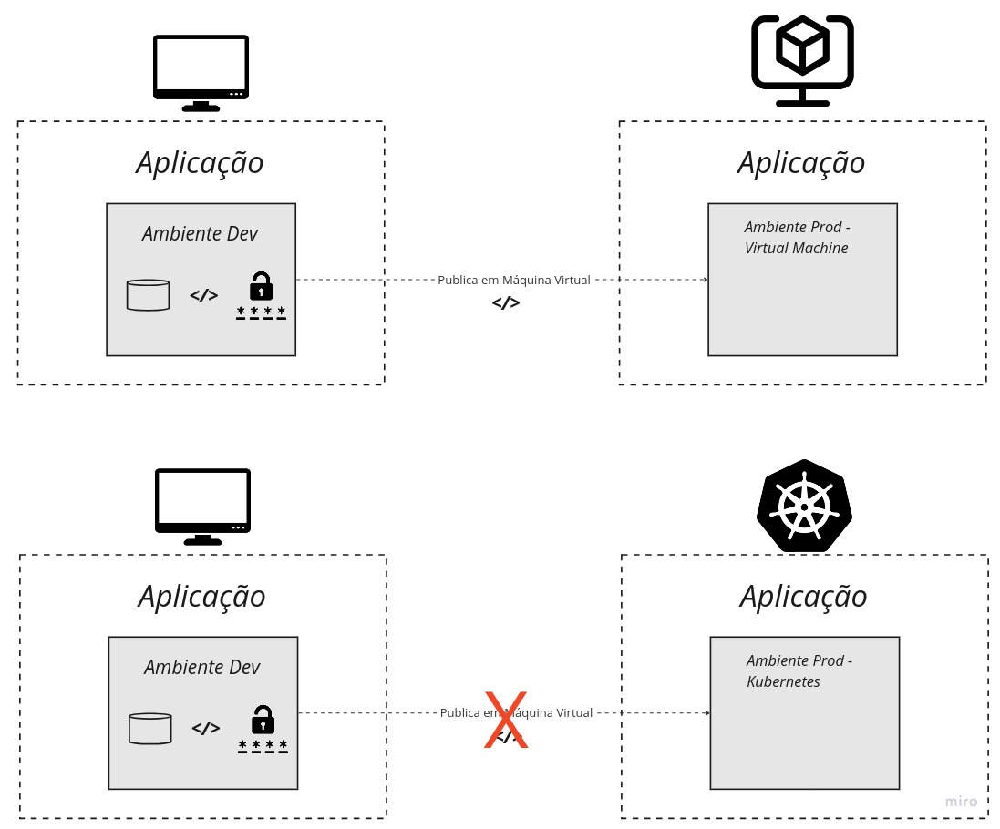
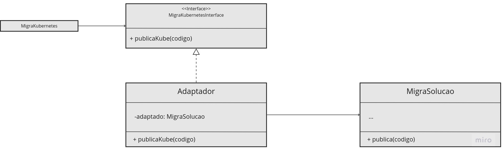

<table>
  <tr>
    <td>
        
    </td>
    <td>
      <H4>Prof. Me. Alexandre Henrick</H4> <H4>Análise e Desenvolvimento de Sistemas - 6º período Sistemas de Informação</H4>
    </td>
  </tr>
</table>

---

<center><H1>Adapter</H1></center>


**Descrição**

O nome **Adapter** descreve perfeitamente bem a aplicabilidade deste padrão. O Adapter permite a colaboração de **objetos com interfaces incompatíveis**. Isto é, conseguimos permitir que um objeto adapte-se à interface de outro objeto sem precisar modificar o código-fonte desse objeto. De maneira resumida, a implementação do Adapter envolve a criação de uma **Classe** intermediária, chamada de **adaptador**, que implementa a interface desejada e ao mesmo tempo mantém uma referência ao objeto que possui a interface incompatível. Dessa forma, conseguimos fazer a tradução necessária das chamadas dos métodos.

---

**Cenário**

Vamos imaginar um cenário para ilustrar o uso do Adapter:

Em sua empresa, você desenvolveu um código que realiza a migração dos produtos do ambiente de desenvolvimento para o ambiente de produção de maneira automatizada. Nesse código, você publica suas aplicações em uma máquina virtual de produção, que é o padrão usado na empresa. Recentemente, o gerente do projeto lhe pediu para não publicar as aplicações na máquina virtual. Agora, será necessário utilizar uma nova tecnologia, o Kubernetes.



Sabendo que novas mudanças podem ser requisitadas no futuro e que também é necessário escrever um código que seja fácil de manter, você decide que irá utilizar o padrão **Adapter**. O diagrama de classes do Adapter usando o cenário acima como exemplo ficaria como a imagem abaixo. Dessa maneira, nossa classe que já executa a migração poderá ser reutilizada e seu método será adaptado para migrar dentro de um cluster Kubernetes.



---

**Quando utilizar o Adapter?**

1 - **Integração em sistemas legados**: Quando precisamos integrar um sistema novo com componentes de um sistema antigo que possuem interfaces diferentes. Por exemplo, se o sistema legado possui uma funcionalidade que ainda seja muito importante e não podemos abrir mão, podemos usar o Adapter para integrar essa funcionalidade no novo sistema.

2 - **Reutilização de classes**: Quando você deseja reutilizar uma classe existente, mas sua interface não é compatível com o restante do sistema.

3 - **Bibliotecas de terceiros**: Quando você deseja utilizar uma biblioteca ou componente de terceiros que possui uma interface incompatível com a sua aplicação.

4 - **Múltiplas implementações**: Quando você deseja ter várias implementações de uma mesma interface e deseja que elas possam ser usadas de forma intercambiável.

---

**Pontos positivos do Adapter**:

1 - **Reutilização**: O Adapter permite a reutilização de classes existentes, mesmo que suas interfaces sejam incompatíveis com o restante do sistema.

2 - **Separação de responsabilidades**: O adapter isola a lógica de adaptação em uma classe, mantendo a lógica do cliente e a do adaptado separadas. Isso contribui para a manutenção do código.

3 - **Interoperabilidade**: Facilita a comunicação entre componentes que, de outra forma, não poderiam colaborar devido a diferenças em suas interfaces.

---

**Pontos negativos do Adapter**:

1 - **Complexidade adicional**: A introdução de adaptadores pode aumentar a complexidade do código, especialmente quando muitos adaptadores são usados.

2 - **Overhead (Custo adicional de processamento)**: Pode haver um pequeno overhead de desempenho devido às chamadas de método adicionais realizadas pelo adaptador.

---

**Exemplo python do cenário apresentado**

```python
# Classe que realiza migrações para uma máquina virtual
class MigraSolucao:
    def migrate_to_vm(self, aplicacao):
        print("Migrando credenciais...")
        print("Migrando BD...")
        print("Migrando código...")

# Interface alvo para migrações para Kubernetes
class MigraKubernetesInterface:
    def migrate_to_kubernetes(self, aplicacao):
        pass

# Adaptador para realizar migrações para Kubernetes usando MigraSolucao
class Adaptador(MigraKubernetesInterface):
    def __init__(self, migrator):
        self.migrator = migrator

    def migrate_to_kubernetes(self, aplicacao):
        print(f"Adaptando o método de migração para publicar a apĺicação {aplicacao} no kubernetes...")
        self.migrator.migrate_to_vm(aplicacao)  # Redirecionar para a migração para VM
        print("Publicando no cluster...")

# Classe concreta que realiza migrações para Kubernetes
class MigraKubernetes(MigraKubernetesInterface):
    def migrate_to_kubernetes(self, aplicacao):
        print(f"Migrating code '{aplicacao}' to Kubernetes")

# Criando uma instância da classe MigraSolucao
migrator = MigraSolucao()

# Criando uma instância do adaptador para migrações para Kubernetes
kubernetes_adapter = Adaptador(migrator)

# Criando uma instância da classe MigraKubernetes
real_kubernetes_migrator = MigraKubernetes()

# Executando as migrações
aplicacao = "some_code"
kubernetes_adapter.migrate_to_kubernetes(aplicacao)  # Usando o adaptador para migração para Kubernetes
#real_kubernetes_migrator.migrate_to_kubernetes(aplicacao)  # Usando a classe concreta para migração para Kubernetes
```