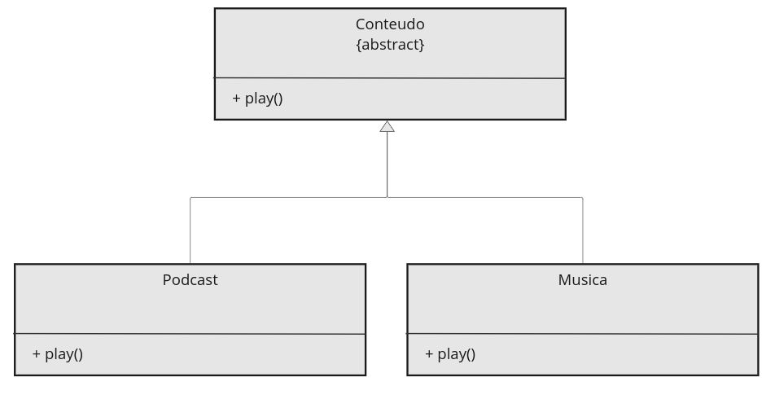
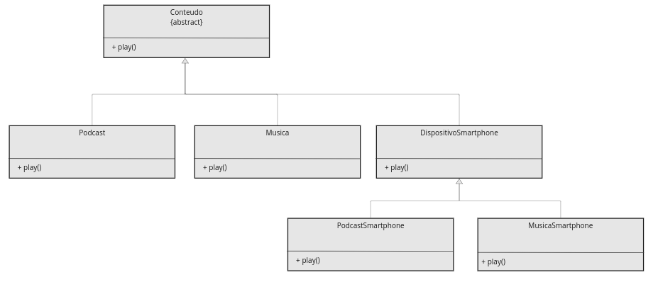
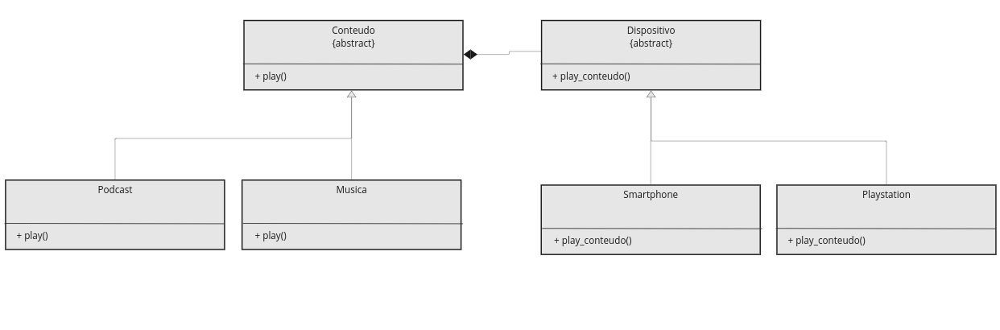

<table>
  <tr>
    <td>
        
    </td>
    <td>
      <H4>Prof. Me. Alexandre Henrick</H4> <H4>Análise e Desenvolvimento de Sistemas - 6º período Sistemas de Informação</H4>
    </td>
  </tr>
</table>

---

<center><H1>Bridge</H1></center>

**Descrição**

Assim como o Adapter é um padrão **estrutural**, e tem como objetivo separar a abstração (abstração de alto nível - que delega) de sua implementação (implementação de baixo nível). Importante lembrar que nesse contexto **não estamos falando de classes abstratas como vimos em orientação a objetos**. No contexto do Bridge, a **Abstração é um código que delega ações para outro objeto**, e a **Implementação é o código que realmente implementa essas ações**. O Bridge busca desacoplar a abstração da implementação permitindo que ambas cresçam de maneira independente. Ou seja, vamos ter diferentes hierarquias em nosso código, facilitando sua manutenção.

---

**Cenário**

Suponha que estamos construindo uma solução onde será possível tocar diferentes tipos de conteúdos, como podcasts e músicas etc. O UML abaixo pode representar uma maneira de criar as classes que precisamos e se for necessário criar mais um tipo de conteúdo, podemos adicionar uma classe.

<center></center>

O problema que podemos encontrar aqui é quando precisamos aumentar as dimensões da nossa solução. Imagina que agora eu queira que os conteúdos sejam tocados em diferentes tipos de dispositivos. Eu poderia criar uma classe nova herdando da classe "Conteúdo" para poder ter o método "play()", mas eu preciso que cada tipo de conteúdo (Podcast e Musica) também sejam tocados nesses dispositivos. Então nosso diagrama de classes ficaria algo como a imagem abaixo.

<center></center>

O que o padrão Brige sugere é separar a abstração "Conteudo" da implementação "DispositivoSmartphone" e criar um relacionamento do tipo **"composição"** entre elas. Dessa maneira, conseguimos desacoplar e permitir com que ambas "dimensões" cresçam separadamente.

<center></center>

---

**Quando utilizar**

- Variação dupla: Quando você tem duas dimensões de variações no sistema e deseja evitar a criação de muitas classes;
- Desacoplamento: Desacoplar abstração de implementação para que ambas possam ser alteradas sem uma afetar a outra;
- Flexibilidade: Quando você quer que suas abstrações e implementações possam ser estendidas ou alteradas independentemente para acomodar novos requisitos;
- Reutilização: Quando você deseja reutilizar abstrações e implementações existentes em diferentes combinações, proporcionando maior modularidade.

---

**Pontos positivos**:

- Separação de Preocupações: O padrão Bridge promove uma separação clara entre a abstração e a implementação, permitindo que elas evoluam de forma independente e reduzindo o acoplamento entre elas.

- Extensibilidade: É mais fácil estender o sistema, adicionando novas classes de abstração ou implementação, sem afetar as classes existentes.

- Reusabilidade: As implementações podem ser reutilizadas por várias abstrações, e vice-versa. Isso promove o reuso de código.

---

**Pontos negativos**:

- Complexidade Inicial: A introdução das hierarquias de abstração e implementação pode aumentar a complexidade inicial do código.

- Código Adicional: Pode resultar em um número maior de classes, o que pode ser excessivo para sistemas simples.

- Coordenação: Se mal projetado, pode resultar em um aumento da complexidade na coordenação entre as hierarquias de abstração e implementação.

- Escolha Inadequada: A escolha inadequada de abstrações e implementações pode levar a um design confuso e difícil de entender.

---

**Exemplo python do cenário apresentado**

```python
'''
Ao invés de criar inúmeras classes, vamos criar abstrações para cada dimensão (implementação de alto nível).
Cada implementação vai conter uma herança de sua abstração e o relacionamento vai existir apenas
entre as abstrações e não as implementações.

No nosso cenário vamos ter uma relação de composição entre conteúdo e dispositivo (conteúdo depende do dispositivo).
O conteúdo irá conter um atributo que será do tipo do dispositivo. Assim, dentro de cada conteúdo conseguimos
interagir com os métodos dos dispositivos.

Aqui nosso código está desacoplado. Cada dimensão pode crescer separadamente. Se necessário, basta criar uma classe
extra e isso não irá comprometer seu código.

Podemos ainda adicionar mais dimensões, e essas ficarão desacopladas.
'''

class Dispositivo:
    def toca_conteudo(self, conteudo_tocar):
        pass

class Smartphone(Dispositivo):
    def toca_conteudo(self, conteudo_tocar):
        print(f"No smartphone, tocando {conteudo_tocar}")

class Playstation(Dispositivo):
    def toca_conteudo(self, conteudo_tocar):
        print(f"No Playstation, tocando {conteudo_tocar}")

class Conteudo:
    def __init__(self, dispositivo):
        self.dispositivo = dispositivo #Atributo dispositivo. Aqui vamos poder usar os métodos dos dispositivos

    def play(self):
        pass

class Podcast(Conteudo):
    def play(self):
        self.dispositivo.toca_conteudo("Podcast")

class Musica(Conteudo):
    def play(self):
        self.dispositivo.toca_conteudo("Musica")

sp = Smartphone()
musica = Musica(sp)
musica.play()

ps = Playstation()
pod = Podcast(ps)
pod.play()

```