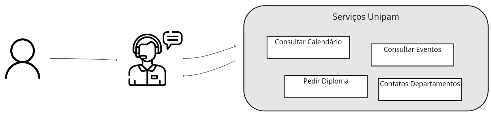
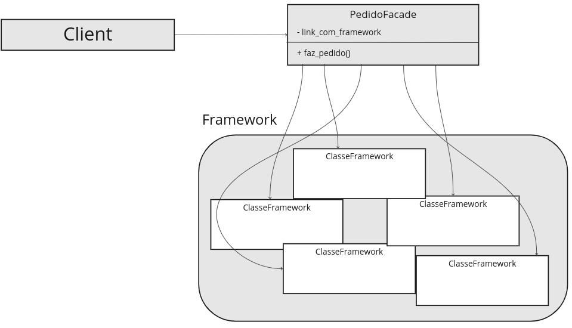

<table>
  <tr>
    <td>
        
    </td>
    <td>
      <H4>Prof. Me. Alexandre Henrick</H4> <H4>Análise e Desenvolvimento de Sistemas - 6º período Sistemas de Informação</H4>
    </td>
  </tr>
</table>

---

<center><H1>Facade (Façade)</H1></center>

## **Descrição**

O **Facade**, ou **Fachada**, é um padrão de projeto do tipo estrutural. É um dos padrões mais simples e úteis. Ele fornece uma interface simplificada entre seu código um conjunto complexo de classes. Também pode ser utilizado para fazer uma interface simplificada para outras bibliotecas e frameworks. Essa interface atua como uma "fachada", ocultando a complexidade subjacente e tornando mais fácil para os clientes (ou outros sistemas) interagir com as funcionalidades de sistemas terceiros.

**PONTO IMPORTANTE**: Quando usamos o termpo "interface" para explicar o facade, não necessariamente estamos nos referindo a "Interfaces de Orientação a Objetos", ou aquelas Interfaces onde uma classe concreta precisa implementar. É apenas um termo didático. 

Imagine que você esteja ligando para o Unipam para obter uma informação específica sobre o curso de Sistemas de Informação. O Unipam uma quantidade enorme de serviços que podem ser consultados, mas você precisa acessar apenas um deles. O atendente será sua interface com esses serviços, ocultando toda complexidade e levando a você apenas a informação desejada.

<center></center>

## **Cenário**

Quando estamos usando outros frameworks e bibliotecas, eles possuem suas próprias lógicas de uso. Muitas vezes eles podem exigir a criação de objetos, passagem desses objetos como parâmetros, chamar vários métodos e outros tipos de operações. Como não podemos mudar essa lógica, nosso código que irá interagir com alguma funcionalidade dessas bibliotecas poderá ficar muito dependente, ou **acoplado** a lógica das bibliotecas. Sabendo disso, podemos criar uma "fachada" que irá **encapsular** toda essa complexidade e entregar para o nosso código apenas o necessário.

Imagine o seguinte cenário: Você está trabalhando em um projeto para automação das operações de um grande restaurante. Esse restaurante já utiliza um framework que realiza a verificação de todos os requisitos para atender um pedido (Se possui ingredientes disponíveis, pagamento etc), mas ainda não foi implementado o lado do usuário, onde o mesmo deve ser capaz de lançar seu pedido. O **lançamento do pedido** deve interagir com toda essa parte do framework que realiza as verificações para que o pedido seja processado e concluído. Para esse cenário, você pode utilizar um Façade para encapsular a lógica complexa do framework e "escondê-la" do seu código.

<center></center>

## **Pontos positivos**

- Simplicidade: Facilita o uso do sistema, proporcionando uma interface simples;
- Encapsulamento: Isola o cliente da complexidade interna, permitindo que as mudanças internas sejam feitas sem afetar o cliente;
- Desacoplamento: Reduz o acoplamento entre o cliente e os componentes subjacentes, promovendo uma arquitetura mais flexível.

## **Pontos negativos**

- Limitação de Flexibilidade: Pode ocultar funcionalidades mais avançadas que alguns clientes podem precisar;
- Complexidade Interna: Se a fachada não for projetada corretamente, pode se tornar um ponto de complexidade adicional.

## **O problema da "God class"**

O "God class", ou "Classe Deus", é um problema que pode acontecer quando uma classe implementa muitas responsabilidades. Já discutimos e entendemos que em Engenharia de Software é ideal manter a separação das responsabilidades, reduzindo o alto acoplamento. Como o Facade é uma simples Interface que vai encapsular toda a lógica de outro conjunto complexo de classes, existe a possibilidade dessa classe se torna responsável por muitas tarefas.

---

## **Exemplo python do cenário apresentado**

```python

#========= Conjunto Complexo de Classes - Módulo de Pedido =========

# Subsistema: Cozinha
class Cozinha:
    def preparar(self, prato):
        print(f"Preparando o prato: {prato}")

# Subsistema: Estoque de Ingredientes
class Estoque:
    def verificar_ingrediente(self, ingrediente):
        print(f"Verificando estoque de {ingrediente}")
        return True

    def usar_ingrediente(self, ingrediente):
        print(f"Usando {ingrediente} do estoque")

# Subsistema: Sistema de Pagamento
class Pagamento:
    def processar_pagamento(self, valor):
        print(f"Processando pagamento de R${valor}")

# Subsistema: Sistema de Entrega
class Entrega:
    def agendar_entrega(self, endereco):
        print(f"Agendando entrega para {endereco}")

#========= Implementação do Facade =========

# Facade: PedidoFacade
class PedidoFacade:
    def __init__(self):
        self.cozinha = Cozinha()
        self.estoque = Estoque()
        self.pagamento = Pagamento()
        self.entrega = Entrega()

    def fazer_pedido(self, prato, endereco, valor):
        if self.estoque.verificar_ingrediente(prato):
            self.cozinha.preparar(prato)
            self.estoque.usar_ingrediente(prato)
            self.pagamento.processar_pagamento(valor)
            self.entrega.agendar_entrega(endereco)
            print(f"Pedido de {prato} entregue com sucesso!")

# Cliente
pedido = PedidoFacade()
pedido.fazer_pedido("Pizza", "123 Rua Principal", 25.0)
```